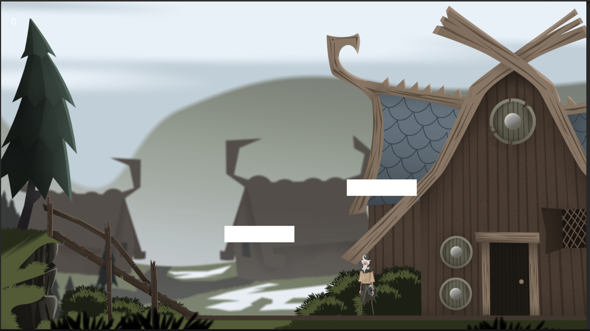
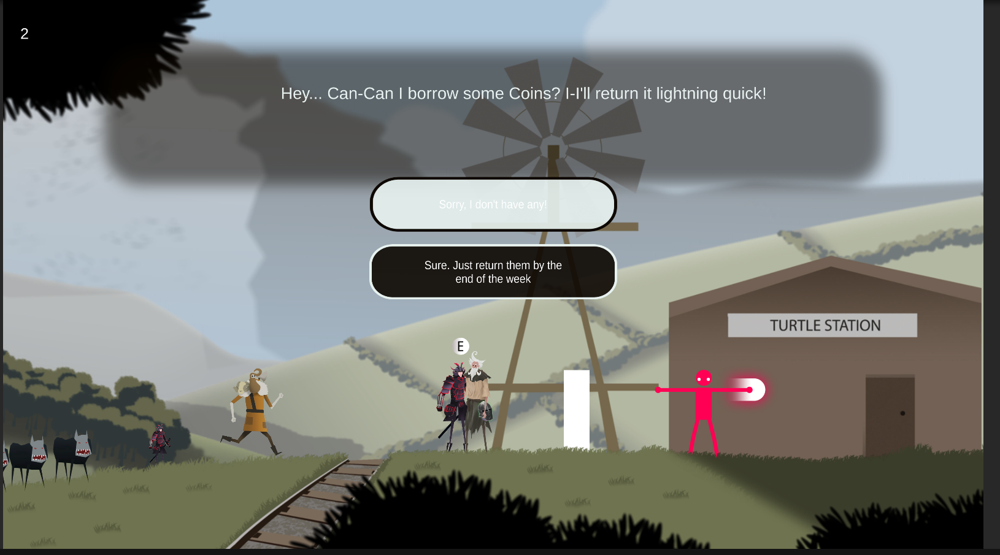

# Pastbound 🔗 (Unity 2D Game Prototype)


> *An action-adventure game set in an unforgiving world, where a young hero must battle evil creatures.*

---

## About the Game
**Pastbound** is a **2D action-adventure prototype** developed in Unity. This game features a rich narrative, fluid movement mechanics, and interactive environments.

## Features
- **Advanced Collision Detection**: Supports wall collisions, ground slope detection, and smooth movement.
- **Optimized Jumping Mechanics**: Responsive and dynamic controls for enhanced player experience.
- **Camera Management**: Smooth tracking and scene transitions for immersive gameplay.
- **Basic Enemy AI**: Includes pathfinding and attack behaviors for engaging combat.
- **Interactive Dialogue System**: Enables character interactions and branching narratives.

## Screenshots & GIFs

| Gameplay | Combat | Dialogue System |
|----------|--------|----------------|
|  |  |  |

## Technologies Used
- **Game Engine:** Unity 2D
- **Programming Language:** C#
- **AI & Pathfinding:** Unity NavMesh / Custom AI Logic
- **Dialogue System:** Custom-built for branching choices

## Installation & Play
1. **Clone the repository:**
   ```sh
   git clone https://github.com/yourusername/pastbound.git
   ```
2. **Open in Unity:** Unity 2021.3.18 recommended.
3. **Run the game:** Click **Play** inside the Unity Editor.

## Roadmap
- [ ] Advanced enemy AI
- [ ] Expanded story elements
- [ ] Multiplayer co-op mode

## Contributing
Contributions are welcome! Feel free to **fork** the repo and submit pull requests.

## License
This project is licensed under the **MIT License**.

---
